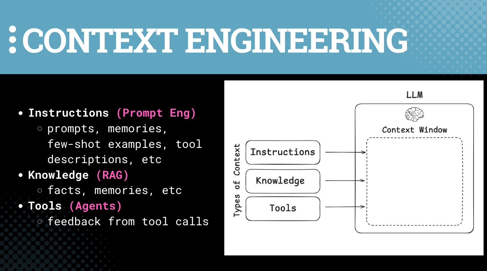

# Session 14: 🔌 MCP Connectors

🎯 Learn how to leverage collections of tools to enhance retrieval by sitting on the client side of MCP servers.

📚 **Learning Outcomes**
- Understand how to use MCP to enhance retrieval
- Learn about the pros and cons of leveraging MCP on the client side

🧰 **New Tools**
- [Model Context Protocol](https://github.com/modelcontextprotocol)
- [LangChain MCP Adapters](https://github.com/langchain-ai/langchain-mcp-adapters)

## 📛 Required Tooling & Account Setup
- A GitHub account (free tier is fine) with a Personal Access Token (fine-grained, repo scope)
- An X (Twitter) Developer account with a Bearer Token recommended to load $5 in credits.
   
## 📜 Recommended Reading
- [MCP Announcement](https://www.anthropic.com/news/model-context-protocol) (Nov 2025)
- [About MCP](https://modelcontextprotocol.io/about) (from the spec)
- [MCP](https://docs.langchain.com/oss/python/langchain/mcp), by LangChain

# 🗺️ Overview

# **Model Context Protocol (MCP)**

Model Context Protocol, or MCP, was open-sourced by Anthropic (Nov 2024). The creators of the protocol talk about the backstory [here](https://youtu.be/CQywdSdi5iA?si=RMiWJhJeCYAUZASw&t=195). 

> MCP is just my way for putting my workflow into an AI application in a very simple way…It’s just a way to give context to an application that uses an LLM; it can be tools, it can be raw context, whatever you’d like it to be. ~ [David Soria Parra](https://x.com/dsp_), Co-Creator of MCP [[Ref](https://www.youtube.com/watch?v=CQywdSdi5iA)]
> 

It exposes three main things: tools, resources (e.g., raw data), and prompts. These are the three main things that MCP servers can expose for now. We’ve heard this before!

  

It is often marketed as the “USB-C for AI”: a single, universal plug that lets LLM-powered apps tap live data (calendars, Gmail, Slack, Google Drive, GitHub, etc.).

MCP was constructed on the same basic idea as [Microsoft’s Language Server Protocol](https://microsoft.github.io/language-server-protocol/) - e.g., `A *Language Server* is meant to provide the language-specific smarts and communicate with development tools over a protocol that enables inter-process communication.`Now imagine what Model Context Protocol is!

There has been an adoption snowball driven by a ton of excitement in the industry throughout 2025: first-party servers now from GitHub, Slack, Google, Cursor, etc.; and even OpenAI and Microsoft have announced their support (Mar–Apr 2025).

Recently, [full MCP connectors in ChatGPT](https://help.openai.com/en/articles/12584461-developer-mode-and-full-mcp-connectors-in-chatgpt-beta) came out. That means that:

> With full MCP support and ChatGPT [**developer mode**](https://platform.openai.com/docs/guides/developer-mode), your organization can build, test, and deploy MCP-powered connectors that let ChatGPT securely take action in your tools. Admins can publish connectors to the workspace and control access using role-based permissions
> 

This is actively something that our clients are interested in at AI Makerspace, so we know there is enterprise interest. This is worth knowing!

As a result, we want to walk you through ChatGPT [**connectors](https://help.openai.com/en/articles/11487775-connectors-in-chatgpt).** This builds on the core idea behind RAG, and also behind Agentic RAG; effectively enhancing our ability to do retrieval.

# Building for LLMs (Agents)

Step 1: we must understand that we can *use MCP to interact with agents (LLMs).*

> The question is what do models interact with? *They don’t interact directly with APIs*. They interact with prompts and tools and whatever you’re giving the model to ingest. MCP standardizes how you take that data and actually give it to the model. ~ Theo Chu [[Ref](https://www.youtube.com/watch?v=CQywdSdi5iA)]
> 

Step 2: we must understand that *when we use MCP to interact with agents (LLMS)*, we must treat them differently than we would a human programmer using APIs or an agent with access to APIs.

In the same way that an API is fully self-contained (e.g., response-request), we want to make sure that *the way we use MCP* is also fully self-contained, because remember, it’s most likely use is for **other agents**, not humans.

Even in the case that we want a tool loadout to be useful to others in our organization, what we really want isn’t simply the access to those tools.

What we want instead is that when we engage with a set of tools (or more generally tools, raw data, and prompts), *we are also engaging with a particular process by which we are to leverage them*.

> The solution is building tools around complete user goals rather than API capabilities. Instead of four separate tools, create one **`deploy_project`** tool that handles the entire workflow internally. ~ [The second wave of MCP](https://vercel.com/blog/the-second-wave-of-mcp-building-for-llms-not-developers), by Vercel
> 

Check out this great example starting with “[This changes everything about tool design](https://vercel.com/blog/the-second-wave-of-mcp-building-for-llms-not-developers#:~:text=This%20changes%20everything%20about%20tool%20design%3A),” and denote the differences between an “API-shaped MCP server” and an “intention-based MCP server.”

In the end, we should be designing workflow-based MCP tools.

In the end, as we’ve seen throughout this course, it’s not just dumb input-output, and it’s also not just pure chaotic agency. All agentic systems include workflows and agents. 

# Conclusions

> Think of MCP tools as tailored toolkits that help an AI achieve a particular task, not as API mirrors.
> 

> MCP works best when tools reflect complete user goals.
> 

Build with MCP when building for agents, not humans.

# PS - On Security

Finally, there’s a great joke going around about MCP.

The S stands for security.

Of course, there’s no S.

As [Palo Alo Networks explains](https://www.paloaltonetworks.com/blog/cloud-security/model-context-protocol-mcp-a-security-overview/?utm_source=chatgpt.com), there are several risks that are immediately evident: prompt injection, credentials exposure, and unverified third-party tools.

Correspondingly, a few best-practices exist, including great logging, org-specific governance procedures for your companies use of MCP servers, and ensuring that API keys stay hidden.

There is, of course, a ton of security work to be done in a world run by agents.

As with all things, start small, build simply, and ensure you’re creating value.

### 🕳️ Go Deeper

- Listen to [the entire overview](https://www.youtube.com/watch?v=CQywdSdi5iA) by the co-creator of MCP with Anthropic
- Take a look at the actual [Technical Specification](https://modelcontextprotocol.io/specification/2025-06-18) of MCP
