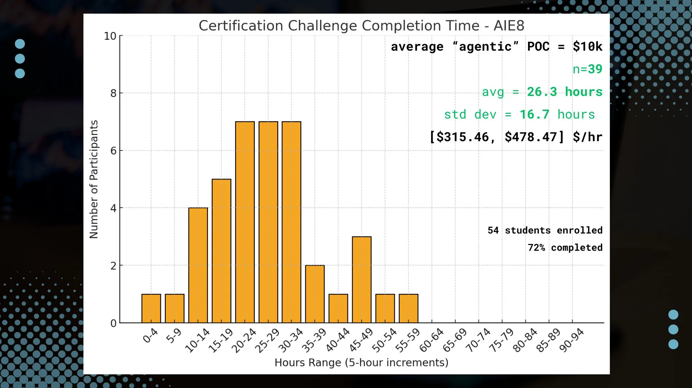

## <h1 align="center" id="heading">Session 12: Industry Use Cases</h1>
| 📰 Session Sheet | ⏺️ Recording     | 🖼️ Slides        | 👨‍💻 Repo         | 📝 Homework      | 📁 Feedback       |
|:-----------------|:-----------------|:-----------------|:-----------------|:-----------------|:-----------------|
| [Industry Use Cases](https://github.com/AI-Maker-Space/AIE9/tree/main/00_Docs/Session_Sheets/12_Industry_Use_Cases) |[Recording!](https://us02web.zoom.us/rec/share/SBatPUo5ZEFKDBhjl1tNo4LxgkZJU9SUHCcPQZZY-MPSw5SA-DT78c_RLIglQD8.84JOZk6uq0hNt4Ov)   passcode: `G9?vCPR!`| [Session 12 Slides](https://www.canva.com/design/DAG-EPmlD1w/8U1cQ_UuwRej5uZNxaI1ZQ/edit?utm_content=DAG-EPmlD1w&utm_campaign=designshare&utm_medium=link2&utm_source=sharebutton) | You are here! | [Certification Challenge](https://forms.gle/yxvhpXiaMDUJ28Gv5) | [Feedback 2/19](https://forms.gle/jKhV6qgksdvgFhWw5) |

# Requirements for Certification Challenge Submissions

1. A public (or otherwise shared) link to a **GitHub repo** that contains:
- A 5-minute (OR LESS) Loom video of a live **demo of your application** that also describes the use case.
- A **written document** addressing each deliverable and answering each question
- All relevant code

You must complete each of the following tasks:

## 🧱 Task Roadmap

> Each task ends with a concrete deliverable.

| Task | Outcome |
|------|---------|
| 🧩 1. Problem + Audience | Clear user + success criteria |
| 💡 2. Solution | Proposed system + UX flow |
| 🔐 3. Data + Keys | Data source + API access working |
| 🤖 4. Prototype | End-to-end agentic RAG running |
| 🧪 5. Eval Baseline | Synthetic set + baseline score |
| 🧠 6. Retriever Upgrade | Improved metrics + analysis |
| 🎬 7. Next Steps | Towards polished Demo Day |

# 🗺️ Overview

Welcome to the middle of the course!  We’re 5 weeks in, and we’ve covered a lot of ground - you all certainly have enough prototyping skill to be dangerous!

It’s time to align the skills we’ve learned with the specific direction that _you’re aiming at_.

What are your goals for 2026? How can you build 🏗️, ship 🚢, and share 🚀 your way towards achieving them?

The Certification Challenge invites you to take a step towards them.

> 💡 Remember, *you know enough already to be dangerous*. You already know enough of the concepts and code you need to build, ship, and share production AI applications

It's time to put your skills to the test!

## Setting Expectations

During Cohort 8, here is how the numbers shook out. It took an average of 26.2 hours for people to complete the challenge. This is up slightly from 23.2 hours on average in Cohort 7.

  

This type of work, though - scoping a problem, creating a solution to that problem that solves a specific pain point for real customers or stakeholders, and engineering it for scale from day 1, is extremely valuable work. **This kind of pilot project work is easily worth $10-20k for as a solo consultant**. Of course, finding the right buyer and getting them to buy is a separate issue...

It is also the kind of work that, after you take a few shots on goal, will become faster and faster for you to knock out.

Finally, it’s worth noting that [Certified AI Engineers](https://aimakerspace.io/graduates/) not only are at the top of hiring lists within our network, but many of them have started their own startups or solo consultancies and still collaborate with us when it comes to generating new business, hiring talent, and serving as enterprise trainers.

What is in your future as an AI Engineer or AI Engineering Leader?

Whatever it is, it will start with the first question of The Certification Challenge: What are you building, and why?

Of course, you've already answered this!

## Your Project Idea

Earlier in the cohort, we asked you to submit a project idea using a framework like this: Problem, Solution, Audience. 

1. What **problem** are you trying to solve? *Why is this a problem?*
2. What is your proposed **solution**? *Why is this the best solution?*
3. Who is the **audience** that has this problem and would use your solution? *Do they nod their head up and down when you talk to them about it?*

That’s really all you need. 

These kinds of things are important to iron out during the project scoping process, which can save us many headaches as we start building if done right!

Remember, _planning is essential_. Thinking through things, step-by-step, and reasoning all the way to the end is extremely valuable to do ahead of excecuting a plan of action.

Agents know this, as humans.

A fitting name it has to do this type of work today: *AI Product Management*. This work asks “**what** should I build and why?”

Once we scope the project, we need to do some *AI Engineering*. This work asks “**how** should I build, evaluate, and improve?”

The best AI engineers can do both.

Once you know the problem to be solved, you must be capable of guiding your team towards implementation.

### Task 1: Articulate the problem and the user of your application

**You are an AI Solutions Engineer**.

**What** problem do you want to solve?  **Who** is it a problem for?

*Hints:* 

- *Create a list of potential questions that your user is likely to ask!*
- *What is the user’s job title, and what is the part of their job function that you’re trying to automate?*

**✅ Deliverables**

1. Write a succinct 1-sentence description of the problem
2. Write 1-2 paragraphs on why this is a problem for your specific user
3. Create a list of questions or input-output pairs that you can use to evaluate your application

### Task 2: Articulate your proposed solution

Now that you’ve defined a problem and a user, *there are many possible solution implementations.*

Choose one, and articulate it.

*Hints:*  
- *Recall the [LLM Application stack](https://a16z.com/emerging-architectures-for-llm-applications/) we’ve discussed*
- *What are the specific solution architecture decisions you need to make, and what are the tradeoffs?*

**✅ Deliverables**

1. Write 1-2 paragraphs on your proposed solution.  How will it look and feel to the user? Describe the tools you plan to use to build it.
2.  Create an infrastructure diagram of your stack showing how everything fits together.  Write one sentence on why you made each tooling choice.
    1. LLM(s)
    2. Agent orchestration framework 
    3. Tool(s)
    4. Embedding model
    5. Vector Database
    6. Monitoring tool
    7. Evaluation framework
    8. User interface
    9. Deployment tool
    10. Any other components you need
3. What are the RAG and agent components of your project, exactly?

### Task 3: Collect your own data (RAG) and choose at least one external API to use (Agent)

**You are an AI Systems Engineer.**  The AI Solutions Engineer has handed off the plan to you. *At a minimum*, you’ll need to implement a simple Agentic RAG solution that includes two aspects:

1. Your own personal data, uploaded to your application (e.g., RAG)
2. The ability to search publicly available data (e.g., a simple agentic search tool like [Tavily](https://tavily.com/))

*Hints:*  
- *Ask other real people (ideally the people you’re building for!) what they think.*
- *What are the specific questions that your user is likely to ask of your application?  **Write these down**.*
  
**✅ Deliverables**

1. Describe the default chunking strategy that you will use for your data.  Why did you make this decision?
2. Describe your data source and the external API you plan to use, as well as what role they will play in your solution. Discuss how they interact during usage. 

### Task 4: Build an end-to-end Agentic RAG application using a production-grade stack and your choice of commercial off-the-shelf model(s)

**✅ Deliverables**

1. Build an end-to-end prototype and deploy it to a *local* endpoint
2. (Optional) Use locally-hosted OSS models instead of LLMs through the OpenAI API
3. (Optional) Deploy your prototype to public endpoint using a tool like [Vercel](http://vercel.com/), [Render](https://render.com/), or [FastAPI Cloud](https://fastapicloud.com/)

### Task 5: Prepare a test data set (either by generating synthetic data or by assembling an existing dataset) to baseline an initial evaluation with RAGAS

**You are an AI Evaluation & Performance Engineer.**  The AI Systems Engineer who built the initial RAG system has asked for your help and expertise in creating a "Golden Data Set" for evaluation.

**✅ Deliverables**

1. Assess your pipeline using the RAGAS framework, including the following key metrics: faithfulness, context precision, and context recall. Include any other metrics you feel are worthwhile to assess.   Provide a table of your output results.
2. What conclusions can you draw about the performance and effectiveness of your pipeline with this information?

### Task 6: Install an advanced retriever of your choosing in our Agentic RAG application

**You are an AI Systems Engineer.**  The AI Evaluation and Performance Engineer has asked for your help in making stepwise improvements to the application. You will work together with them on this task.

**✅ Deliverables**

1. Choose an advanced retrieval technique that you believe will improve your application’s ability to retrieve the most appropriate context.  Write 1-2 sentences on why you believe it will be useful for your use case.
2. Implement the advanced retrieval technique on your application.
3. How does the performance compare to your original RAG application? Test the new retrieval pipeline using the RAGAS frameworks to quantify any improvements. Provide results in a table.

### Task 7: Next Steps

You are the **AI Solutions Engineer** working with the **AI Evaluation & Performance Engineer**. 

1. Do you plan to keep your RAG implementation via Dense Vector Retrieval for Demo Day? Why or why not?

# Your Final Submission

Please include the following in your final submission:

1. A public (or otherwise shared) link to a **GitHub repo** that contains:
- A 5-minute (OR LESS) Loom video of a live **demo of your application** that also describes the use case.
- A **written document** addressing each deliverable and answering each question
- All relevant code
